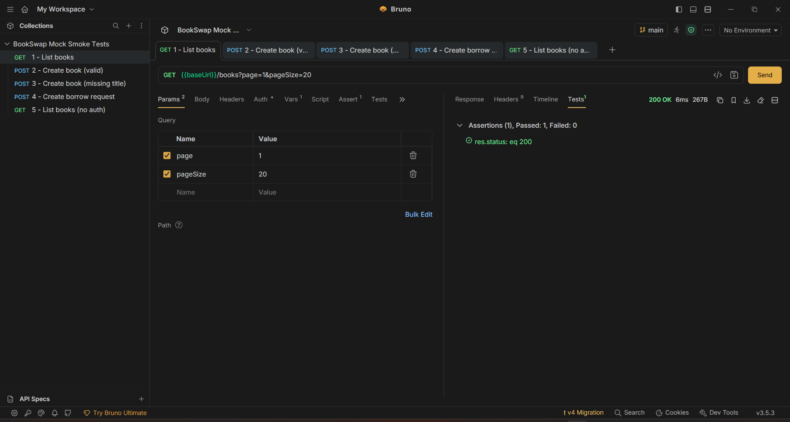
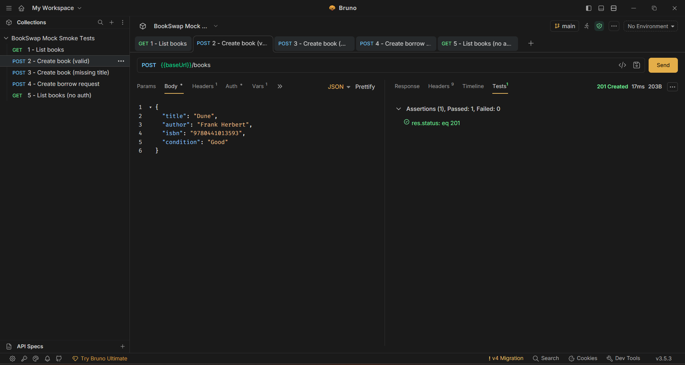
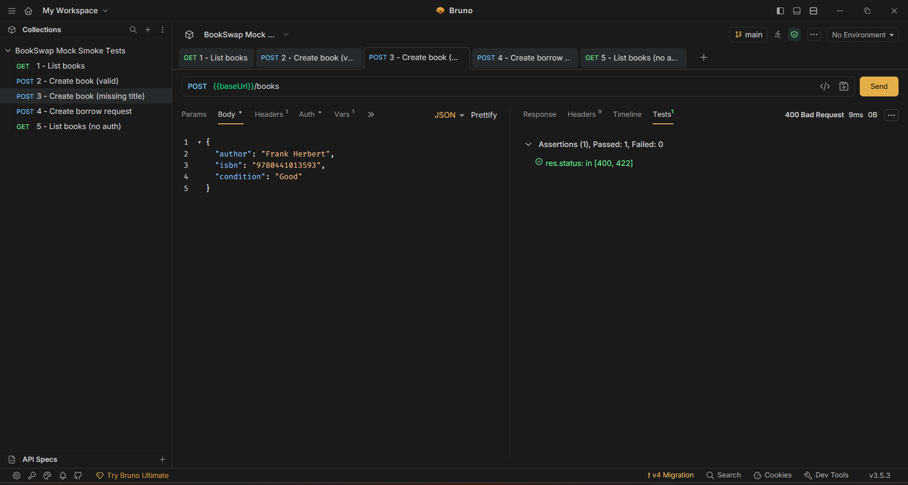
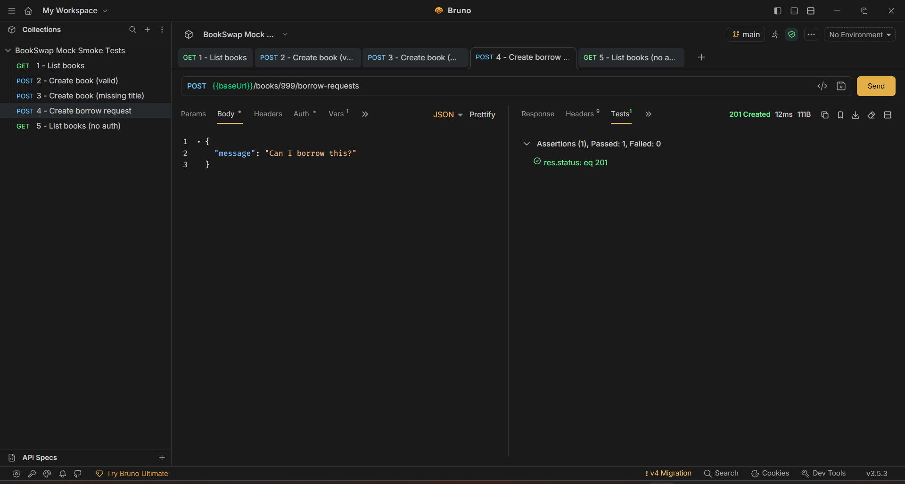
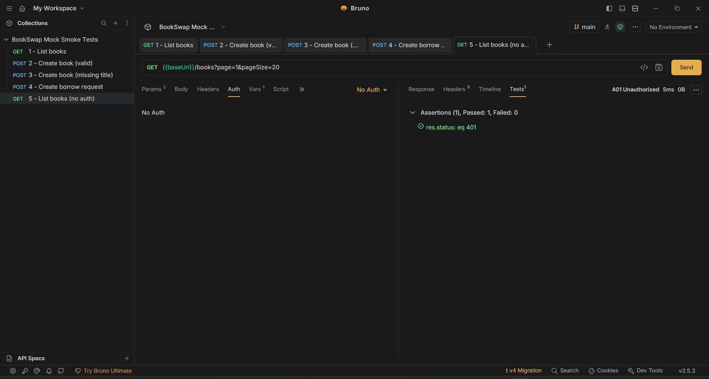
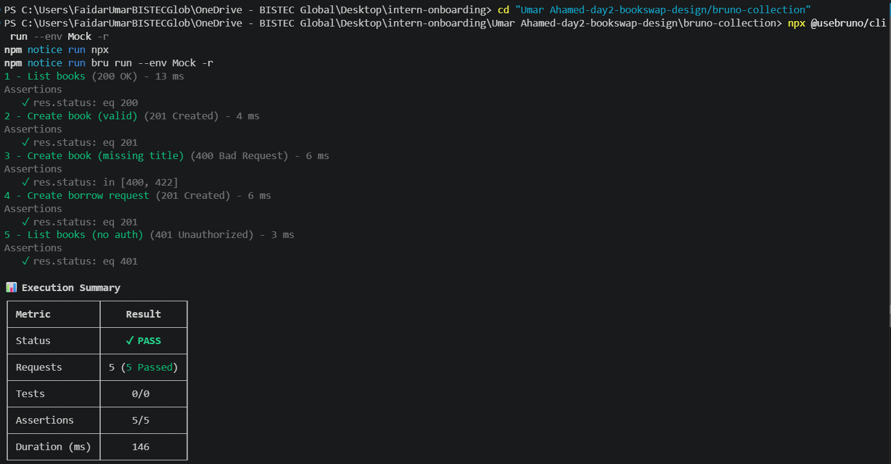

# BookSwap - Mock Smoke Test Report

## Setup

### OpenAPI Validation

```bash
cd "Umar Ahamed-day2-bookswap-design\openapi"

npx @apidevtools/swagger-cli validate "Umar Ahamed - day2-bookswap-openapi.yaml"
```

Result:

```text
Umar Ahamed - day2-bookswap-openapi.yaml is valid
```

### Mock Server

```bash
npx @stoplight/prism-cli mock "Umar Ahamed - day2-bookswap-openapi.yaml" --port 4010
```

Prism started successfully on:

```text
http://localhost:4010
```

### API Testing Tool

- Bruno / Postman
- Requests sent to the Prism mock server running on port 4010

### Import the Bruno Collection

The collection lives in `bruno-collection/` next to this report, with all 5 requests plus a `Mock` environment pointing at `http://localhost:4010`.

1. Open **Bruno Desktop**.
2. Click **Collections** → **Import Collection** (or drag-and-drop the folder onto the app).
3. Select the `bruno-collection` folder.
4. In the top-right environment dropdown, select **Mock**.
5. Make sure the Prism mock server is running (see *Mock Server* above), then open each request and click **Send** — or click the **Run** icon on the collection to run all 5 at once.

### Test Result Screenshots

**Test 1 — `GET /books` (page=1, pageSize=20)**



*200 OK, assertion `res.status: eq 200` passed.*

**Test 2 — `POST /books` (valid payload)**



*201 Created, assertion `res.status: eq 201` passed.*

**Test 3 — `POST /books` (missing title)**



*400 Bad Request, assertion `res.status: in [400, 422]` passed.*

**Test 4 — `POST /books/999/borrow-requests` (borrower JWT)**



*201 Created, assertion `res.status: eq 201` passed.*

**Test 5 — `GET /books` (no Authorization header)**



*401 Unauthorized, assertion `res.status: eq 401` passed. 

---

## Test Results

| # | Endpoint | Method | Body / Parameters | Expected Status | Actual Status | Result |
|---|----------|---------|------------------|----------------|--------------|---------|
| 1 | `/books?page=1&pageSize=20` | GET | page=1&pageSize=20 | 200 | 200 | ✅ Pass |
| 2 | `/books` | POST | Valid book payload | 201 | 201 | ✅ Pass |
| 3 | `/books` | POST | Missing title field | 400 or 422 | 400 | ✅ Pass |
| 4 | `/books/999/borrow-requests` | POST | Borrow request payload | 201 | 201 | ✅ Pass |
| 5 | `/books` | GET | No Authorization header | 401 | 401 | ✅ Pass |

---

## Results Summary



---

## Findings

### Finding 1: Authentication was documented but not actually enforced

When I first reviewed the OpenAPI file, I noticed that several endpoints included a **401 Unauthorized** response, which made it appear that authentication was already handled.

However, after testing the API using Prism, I found that some endpoints could still be accessed without sending an Authorization token. This showed that authentication was documented but not explicitly enforced in the API specification.

To address this, I added a Bearer Authentication security scheme and applied it to the protected endpoints.

---

### Finding 2: Error responses did not provide useful information

During testing, I sent invalid requests, such as creating a book without a required title field.

Although the API correctly returned a **400 Bad Request** status code, the response body was empty.

This means client applications would know an error occurred but would not know what went wrong or how to display a meaningful error message to users.

To improve this, I proposed creating a reusable Error schema that returns a consistent error code and message for all error responses.

---

### Finding 3: The REST API design was easy to understand

While testing the endpoints, I found that the resource-based URL structure was clear and intuitive.

For example:

```text
POST /books/{bookId}/borrow-requests
```

is easier to understand than a verb-based endpoint such as:

```text
POST /borrowBook
```

The URL clearly shows that a borrow request is being created for a specific book.

This confirmed that the API follows good REST design practices, so no changes were needed.

---

### Finding 4: Responses did not include a Request ID

During testing, I noticed that API responses did not contain a request or correlation ID.

If a user reports an issue in production, it would be difficult to match that request with the correct server-side log entry.

To improve troubleshooting and monitoring, I suggested adding an `X-Request-Id` response header to all API responses.

---

## Spec Changes You Would Make

### Change 1 - Add Example Values to Query Parameters

**File:** `openapi/Umar Ahamed - day2-bookswap-openapi.yaml`

**Location:** `GET /books` → `search` query parameter (approximately line 30)

**Current:**

```yaml
- name: search
  in: query
  schema:
    type: string
```

**Suggested:**

```yaml
- name: search
  in: query
  schema:
    type: string
  example: "Clean Code"
```

**Reason:**

While testing the API, I had to guess what value to provide for the search parameter. Adding examples makes the API easier to understand and test.

---

### Change 2 - Add Bearer Authentication Security Scheme

**File:** `openapi/Umar Ahamed - day2-bookswap-openapi.yaml`

**Location:** `components` section (approximately line 250) and protected endpoints such as `GET /books`, `POST /books`, and `POST /books/{bookId}/borrow-requests`

**Suggested:**

```yaml
components:
  securitySchemes:
    bearerAuth:
      type: http
      scheme: bearer
      bearerFormat: JWT
```

```yaml
security:
  - bearerAuth: []
```

**Reason:**

The OpenAPI file documented 401 responses, but Prism did not treat endpoints as protected because no security scheme was defined. This change clearly tells tools that authentication is required.

---

### Change 3 - Add a Reusable Error Schema

**File:** `openapi/Umar Ahamed - day2-bookswap-openapi.yaml`

**Location:** `components.schemas` section (approximately line 270)

**Suggested:**

```yaml
Error:
  type: object
  properties:
    code:
      type: string
    message:
      type: string
```

Then reference it from 400, 401, 404, 409, and 422 responses.

**Reason:**

When testing invalid requests, the mock returned an error status code but no useful response body. A reusable Error schema provides consistent and meaningful error messages.

---

### Change 4 - Add X-Request-Id Response Header

**File:** `openapi/Umar Ahamed - day2-bookswap-openapi.yaml`

**Location:** Response definitions under all endpoints (for example, `GET /books` response section around line 60)

**Suggested:**

```yaml
headers:
  X-Request-Id:
    schema:
      type: string
```

**Reason:**

This helps developers trace requests and match client-side issues with server-side logs during troubleshooting.

---

### Change 5 - Add 429 Too Many Requests Responses

**File:** `openapi/Umar Ahamed - day2-bookswap-openapi.yaml`

**Location:** `GET /books` and `POST /books` response sections

**Suggested:**

```yaml
"429":
  description: Too many requests - rate limit exceeded
```

**Reason:**

Public catalogue endpoints are likely to require rate limiting in the future. Documenting the response now makes the API contract more complete and avoids unexpected changes later.