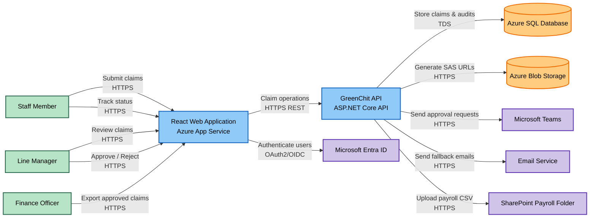
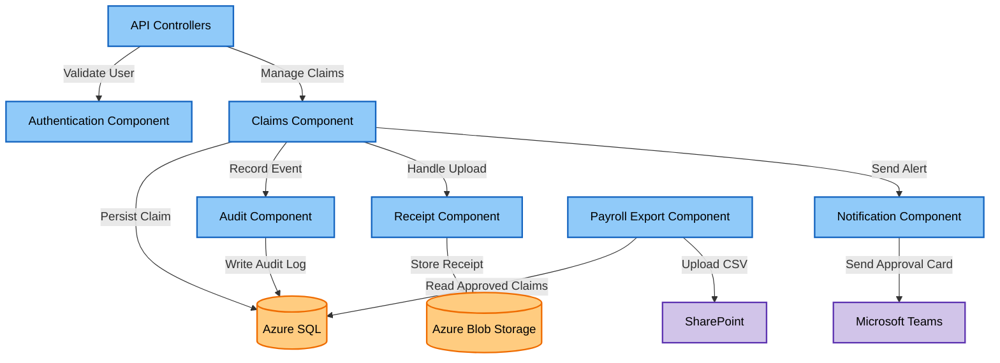

# GreenChit — Architecture Design Pack

## 1. System Context

GreenChit is an internal reimbursement management platform used by BISTEC employees to submit expense claims and upload receipt images for manager approval. The system integrates with Microsoft Entra ID for authentication, Azure Blob Storage for receipt storage, Microsoft Teams and Email for notifications, SharePoint for payroll CSV exports, and Azure SQL for claim and audit data. The primary users are Staff Members, Line Managers, Finance Officers, and Auditors. The solution must provide secure access control, reliable receipt uploads, complete auditability, and support the reimbursement workflow from claim submission through payroll processing.

---

## 2. Containers (C4 Level 2)

### Container Diagram



### Container Table

| Container | Technology | Responsibility |
|------------|------------|------------|
| React Web Application | React + TypeScript + Azure App Service | User interface for staff, managers, and finance officers |
| GreenChit API | ASP.NET Core REST API | Business logic, claim workflow, security, and integrations |
| Azure SQL Database | Azure SQL | Stores claims, approvals, audit logs, and metadata |
| Azure Blob Storage | Azure Blob Storage | Stores receipt image files |
| Microsoft Entra ID | Entra ID | Authentication and Single Sign-On |
| Microsoft Teams | Teams Adaptive Cards | Approval notifications |
| Email Service | Azure Communication Services | Notification fallback |
| SharePoint Folder | SharePoint Online | Payroll CSV export destination |

### Container Relationships

| Source | Target | Relationship |
|----------|----------|----------|
| Staff Member | Web Application | Submit and track claims |
| Line Manager | Web Application | Review and approve claims |
| Finance Officer | Web Application | Export approved claims |
| Web Application | Entra ID | Authenticate users |
| Web Application | GreenChit API | Execute business operations |
| GreenChit API | Azure SQL | Store and retrieve business data |
| GreenChit API | Blob Storage | Store and retrieve receipts |
| GreenChit API | Teams | Send approval notifications |
| GreenChit API | Email Service | Send fallback notifications |
| GreenChit API | SharePoint | Upload payroll export CSV |

---

## 3. Components (C4 Level 3) - GreenChit API

### Component Diagram



### Component Table

| Component | Responsibility |
|------------|------------|
| API Controllers | Expose REST endpoints and route requests |
| Authentication Component | Validate Entra ID tokens and roles |
| Claims Component | Manage claim lifecycle and approval workflow |
| Receipt Component | Handle receipt uploads and retrieval |
| Notification Component | Send Teams and email notifications |
| Audit Component | Record all state transitions and actions |
| Payroll Export Component | Generate and export payroll CSV files |

### Component Relationships

| Source | Target | Relationship |
|----------|----------|----------|
| API Controllers | Authentication Component | Validate user identity |
| API Controllers | Claims Component | Process claim requests |
| Claims Component | Receipt Component | Store and retrieve receipts |
| Claims Component | Notification Component | Trigger notifications |
| Claims Component | Audit Component | Record audit events |
| Audit Component | Azure SQL | Persist audit trail |
| Receipt Component | Blob Storage | Store receipt files |
| Notification Component | Teams | Deliver approval requests |
| Payroll Export Component | SharePoint | Upload payroll CSV |

---

## 4. Reading Order

### Step 1: System Context

Identify:

- Staff Members
- Line Managers
- Finance Officers
- Auditors

Review external systems:

- Microsoft Entra ID
- Azure Blob Storage
- Microsoft Teams
- SharePoint Online

### Step 2: Container Diagram

Review the solution architecture from a deployment perspective:

1. Users access the React Web Application.
2. Authentication is handled through Microsoft Entra ID.
3. Business logic is implemented in the GreenChit API.
4. Claims and audit information are stored in Azure SQL.
5. Receipt images are stored in Azure Blob Storage.
6. Managers receive notifications through Teams and Email.
7. Payroll-ready CSV files are uploaded to SharePoint.

### Step 3: Component Diagram

Zoom into the GreenChit API:

1. API Controllers receive requests.
2. Authentication Component validates users and roles.
3. Claims Component manages the reimbursement workflow.
4. Receipt Component handles attachment storage.
5. Notification Component informs managers.
6. Audit Component records every state transition.
7. Payroll Export Component prepares finance exports.

### Step 4: Follow the Main Business Flow

```text
Staff Member
    ↓
React Web Application
    ↓
API Controllers
    ↓
Claims Component
    ↓
Receipt Component
    ↓
Audit Component
    ↓
Notification Component
    ↓
Line Manager
```

This flow demonstrates how a claim is submitted, audited, and routed for approval while satisfying the business, security, privacy, and compliance requirements of GreenChit.