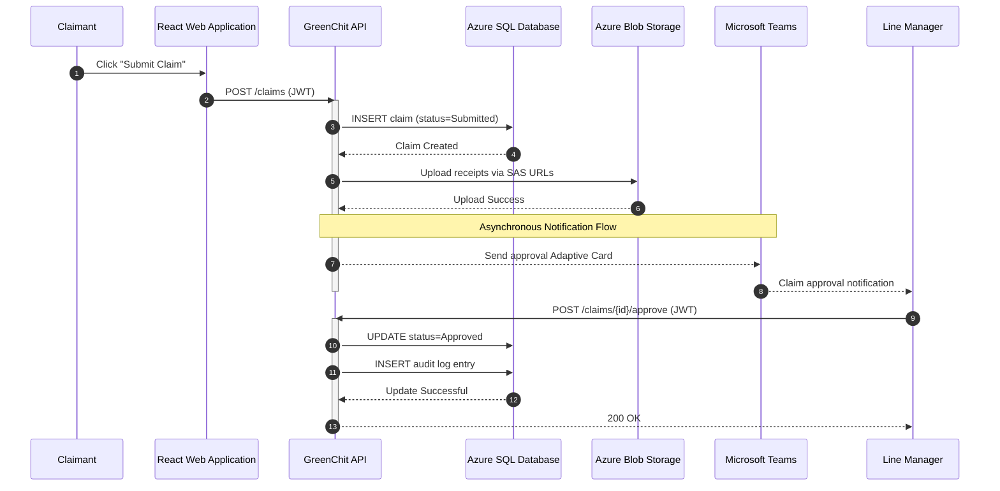
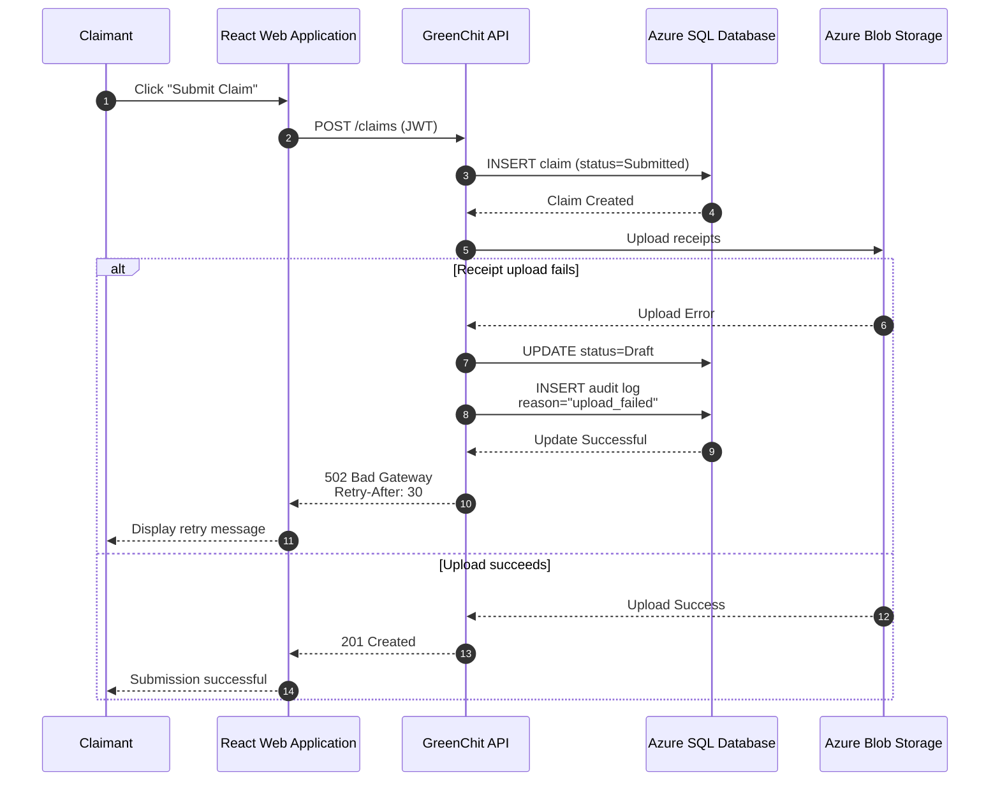

# Sequence Diagram — Submit and Approve a Claim (after review)

## Happy Path

```mermaid
sequenceDiagram
    autonumber

    participant U as Claimant
    participant FE as React Web Application
    participant API as GreenChit API
    participant DB as Azure SQL Database
    participant BLOB as Azure Blob Storage
    participant TEAMS as Microsoft Teams
    participant MGR as Line Manager

    U->>FE: Click "Submit Claim"
    FE->>API: POST /claims (JWT)

    activate API
    API->>DB: INSERT claim (status=Submitted)
    DB-->>API: Claim Created

    API->>BLOB: Upload receipts via SAS URLs
    BLOB-->>API: Upload Success

    Note over API,TEAMS: Asynchronous Notification Flow

    API-->>TEAMS: Send approval Adaptive Card
    TEAMS-->>MGR: Claim approval notification

    deactivate API

    MGR->>API: POST /claims/{id}/approve (JWT)

    activate API
    API->>DB: UPDATE status=Approved
    API->>DB: INSERT audit log entry

    DB-->>API: Update Successful
    API-->>MGR: 200 OK

    deactivate API
```

---

## Error Path — Receipt Upload Fails After Claim Creation

```mermaid
sequenceDiagram
    autonumber

    participant U as Claimant
    participant FE as React Web Application
    participant API as GreenChit API
    participant DB as Azure SQL Database
    participant BLOB as Azure Blob Storage

    U->>FE: Click "Submit Claim"
    FE->>API: POST /claims (JWT)

    API->>DB: INSERT claim (status=Submitted)
    DB-->>API: Claim Created

    API->>BLOB: Upload receipts

    alt Receipt upload fails
        BLOB-->>API: Upload Error

        API->>DB: UPDATE status=Draft
        API->>DB: INSERT audit log<br/>reason="upload_failed"

        DB-->>API: Update Successful

        API-->>FE: 502 Bad Gateway<br/>Retry-After: 30
        FE-->>U: Display retry message
    else Upload succeeds
        BLOB-->>API: Upload Success
        API-->>FE: 201 Created
        FE-->>U: Submission successful
    end
```

